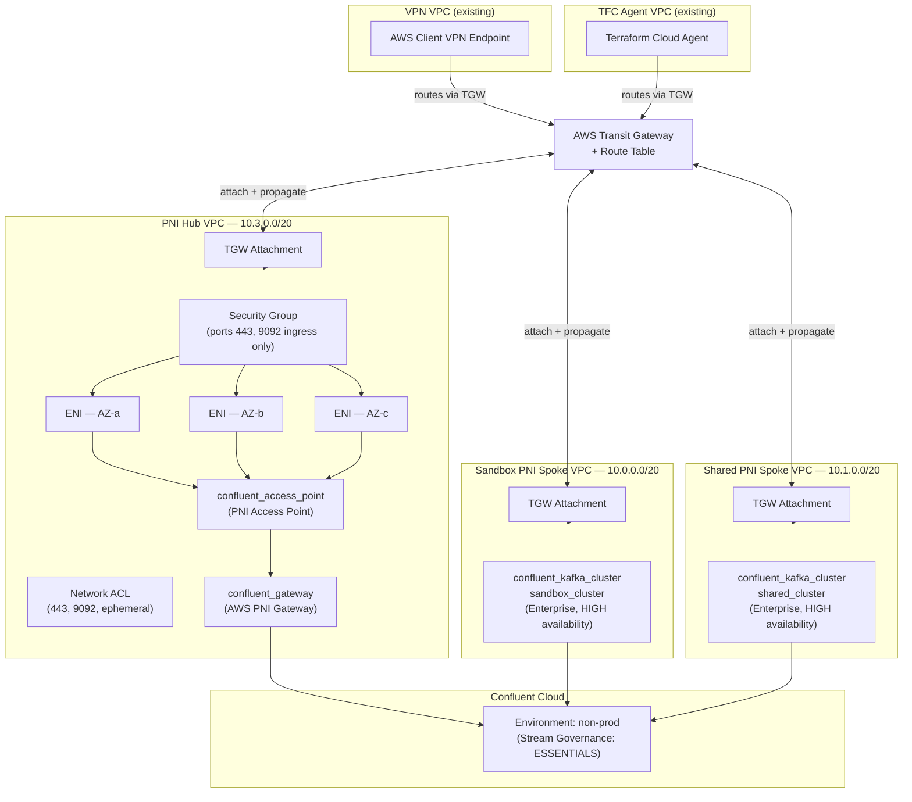

# IaC Confluent Cloud AWS Private Network Interface (PNI), Infrastructure and Networking Example


> **Terraform-managed, hub-and-spoke Private Network Interface (PNI) connectivity between AWS VPCs and Confluent Cloud Enterprise Kafka clusters — deployed via Terraform Cloud.**

---

## Overview

This repository provisions a complete, production-grade private networking topology that connects AWS workload VPCs to Confluent Cloud Enterprise Kafka clusters using **Private Network Interface (PNI)** — Confluent's next-generation private connectivity model that replaces PrivateLink with customer-owned ENIs placed directly in your VPCs.

The architecture follows a **Hub-and-Spoke** pattern:

- A **PNI Hub VPC** owns the ENIs registered with Confluent Cloud and serves as the centralized private connectivity anchor.
- **PNI Spoke VPCs** (sandbox, shared) each host a Confluent Cloud Enterprise Kafka cluster and peer connectivity through the hub via AWS Transit Gateway.
- All VPCs are stitched together through an existing **AWS Transit Gateway (TGW)**, enabling a VPN-connected developer/operator to reach Confluent Cloud endpoints without traversing the public internet.

State is managed remotely in **Terraform Cloud** (organization: `signalroom`, workspace: `iac-cc-aws-pni-infrastructure-networking-example`).

---

## Architecture



---

## Module Structure

```
.
├── main.tf                          # Root: environment, cluster resources, module calls
├── data.tf                          # Data sources: VPCs, VPN endpoint, AZs
├── variables.tf                     # Root-level input variables
├── outputs.tf                       # PNI gateway & access point IDs
├── versions.tf                      # Provider version pins (AWS 6.33, Confluent 2.62, TFE 0.73)
├── provider.tf                      # Provider configuration
├── deploy.sh                        # Bootstrap / teardown script (AWS SSO + TF env vars)
└── modules/
    ├── aws-vpc-confluent-pni-hub/   # PNI Hub module
    │   ├── setup-confluent-pni-hub.tf            # Gateway, access point, VPC, subnets, ENIs, SG
    │   ├── setup-aws-vpc-tgw-private_routing.tf  # TGW attachment, associations, routes
    │   ├── setup-aws-vpc-security_group_rules.tf # NACL rules
    │   ├── setup-aws-network-permissions.tf      # ENI permissions for Confluent's AWS account
    │   ├── data.tf                               # Module-level data sources
    │   ├── variables.tf                          # Module inputs
    │   ├── outputs.tf                            # Gateway/access point IDs exposed to root
    │   └── versions.tf                           # Module provider constraints
    └── aws-vpc-confluent-pni-spoke/              # PNI Spoke module (sandbox, shared)
        ├── main.tf
        ├── data.tf
        ├── variables.tf
        ├── outputs.tf
        └── versions.tf
```

---

## Prerequisites

| Requirement | Detail |
|---|---|
| Terraform | `>= 1.5.0` |
| Terraform Cloud | Organization `signalroom`, workspace pre-created |
| AWS account | SSO profile with sufficient IAM permissions (VPC, TGW, ENI, Client VPN) |
| Confluent Cloud account | API key/secret with environment-level admin |
| Existing AWS Transit Gateway | TGW ID + associated Route Table ID |
| Existing VPN VPC | VPC ID, route table IDs, Client VPN endpoint ID, target subnet IDs |
| Existing TFC Agent VPC | VPC ID + route table IDs |

---

## Configuration

All sensitive values are passed as environment variables (never stored in `.tfvars`). The `deploy.sh` script handles setting `TF_VAR_*` exports automatically after AWS SSO authentication.

### Key Input Variables

| Variable | Description |
|---|---|
| `tgw_id` | Existing Transit Gateway ID |
| `tgw_rt_id` | Transit Gateway Route Table ID |
| `vpn_vpc_id` | VPN VPC ID |
| `vpn_vpc_rt_ids` | Comma-separated VPN VPC route table IDs |
| `vpn_endpoint_id` | AWS Client VPN Endpoint ID |
| `vpn_target_subnet_ids` | Comma-separated VPN associated subnet IDs |
| `tfc_agent_vpc_id` | Terraform Cloud Agent VPC ID |
| `tfc_agent_vpc_rt_ids` | Comma-separated TFC Agent VPC route table IDs |
| `eni_number_per_subnet` | Number of ENIs per subnet (default: `17`) |
| `aws_region` | AWS region for all resources |

### CIDR Allocations

| Network | CIDR |
|---|---|
| PNI Hub VPC | `10.3.0.0/20` |
| Sandbox Spoke VPC | `10.0.0.0/20` |
| Shared Spoke VPC | `10.1.0.0/20` |

All VPCs use 3 subnets across 3 AZs with `/4` new bits of sub-netting.

---

## Deployment

### Create

```bash
./deploy.sh create \
  --profile=<SSO_PROFILE_NAME> \
  --confluent-api-key=<CONFLUENT_API_KEY> \
  --confluent-api-secret=<CONFLUENT_API_SECRET> \
  --tfe-token=<TFE_TOKEN> \
  --tgw-id=<TGW_ID> \
  --tgw-rt-id=<TGW_RT_ID> \
  --tfc-agent-vpc-id=<TFC_AGENT_VPC_ID> \
  --tfc-agent-vpc-rt-ids=<TFC_AGENT_VPC_RT_IDs> \
  --vpn-vpc-id=<VPN_VPC_ID> \
  --vpn-vpc-rt-ids=<VPN_VPC_RT_IDs> \
  --vpn-endpoint-id=<VPN_ENDPOINT_ID> \
  --vpn-target-subnet-ids=<VPN_TARGET_SUBNET_IDs> \
  --pni-hub-vpc-cidr=<PNI_HUB_VPC_CIDR>
```

The script will:
1. Authenticate to AWS SSO and export temporary credentials.
2. Export all `TF_VAR_*` environment variables.
3. Run `terraform init`, `terraform plan`, prompt for confirmation, then `terraform apply`.
4. Generate a Terraform graph visualization at `docs/images/terraform-visualization.png`.

### Destroy

```bash
./deploy.sh destroy \
  --profile=<SSO_PROFILE_NAME> \
  # ... (same arguments as create)
```

Destroy runs `terraform destroy -auto-approve` and regenerates the visualization.

---

## Outputs

| Output | Description |
|---|---|
| `confluent_pni_hub_gateway_id` | ID of the `confluent_gateway` resource (PNI Hub) |
| `confluent_pni_hub_access_point_id` | ID of the `confluent_access_point` resource |

---

## Security Design

**Security Group (PNI ENIs):** Ingress-only on ports `443` (HTTPS/REST/Schema Registry) and `9092` (Kafka), sourced from the PNI Hub VPC CIDR, TFC Agent VPC CIDR, VPN VPC CIDR, and Client VPN CIDR. **No egress rules are defined**, which causes Terraform to revoke AWS's default `0.0.0.0/0` egress — intentionally mirroring PrivateLink's unidirectional behavior and preventing Confluent-initiated connections into the customer network.

**Network ACL:** Allows TCP ingress on `443`, `9092`, and ephemeral ports `1024–65535`. Allows all egress.

**ENI Permissions:** `aws_network_interface_permission` grants Confluent's AWS account `INSTANCE-ATTACH` permission on each customer-owned ENI. This is the core PNI handshake — Confluent attaches its broker VMs to your ENIs without your traffic ever leaving the AWS backbone.

---

## How PNI Differs from PrivateLink

| Aspect | PrivateLink | PNI |
|---|---|---|
| ENI ownership | Confluent's account | **Customer's account** |
| DNS | Requires PHZ + VPC associations | Confluent manages DNS |
| Connectivity model | VPC Interface Endpoint | ENIs registered via `confluent_access_point` |
| Egress control | Unidirectional by design | Explicit empty egress on SG required |
| Port 53 (DNS) rules | Required in SG | **Not needed** |

---

## Provider Versions

| Provider | Version |
|---|---|
| `hashicorp/aws` | `6.33.0` (root) / `>= 6.2.0` (modules) |
| `confluentinc/confluent` | `2.62.0` (root) / `>= 2.40.0` (modules) |
| `hashicorp/time` | `~> 0.13.1` |
| `hashicorp/tfe` | `~> 0.73.0` |

---

## Related Resources

- [Confluent Cloud Private Network Interface (PNI)](https://docs.confluent.io/cloud/current/networking/private-links/aws-privatelink.html)
- [Confluent Terraform Provider](https://registry.terraform.io/providers/confluentinc/confluent/latest/docs)
- [AWS Transit Gateway](https://docs.aws.amazon.com/vpc/latest/tgw/what-is-transit-gateway.html)
- [AWS Client VPN](https://docs.aws.amazon.com/vpn/latest/clientvpn-admin/what-is.html)

## References

- [Confluent PNI Documentation](https://docs.confluent.io/cloud/current/networking/aws-pni.html)
- [Confluent PNI FAQ](https://docs.confluent.io/cloud/current/networking/networking-faq.html#pni-questions)
- [AWS Multi-VPC ENI Attachment](https://docs.aws.amazon.com/AWSEC2/latest/UserGuide/scenarios-enis.html)
- [confluent_gateway Terraform resource](https://registry.terraform.io/providers/confluentinc/confluent/latest/docs/resources/confluent_gateway)
- [confluent_access_point Terraform resource](https://registry.terraform.io/providers/confluentinc/confluent/latest/docs/resources/confluent_access_point)
