# IaC Confluent Cloud AWS Private Network Interface (PNI), Infrastructure and Networking Example


> **Terraform-managed, hub-and-spoke Private Network Interface (PNI) connectivity between AWS VPCs and Confluent Cloud Enterprise Kafka clusters, deployed via Terraform Cloud.**

---

**Table of Contents**
<!-- toc -->
+ [1.0 Overview](#10-overview)
+ [2.0 Architecture](#20-architecture)
+ [3.0 Module Structure](#30-module-structure)
+ [4.0 Prerequisites](#40-prerequisites)
    + [4.1 Client VPN, Centralized DNS Server, and Transit Gateway](#41-client-vpn-centralized-dns-server-and-transit-gateway)
        - [4.1.1 Key Features Required for Confluent PNI to Work](#411-key-features-required-for-confluent-pni-to-work)
            + [**4.1.1.1 Hub-and-Spoke Network Architecture via Transit Gateway**](#4111-hub-and-spoke-network-architecture-via-transit-gateway)
            + [**4.1.1.2 Client VPN Integration**](#4112-client-vpn-integration)
            + [**4.1.1.3 Cross-VPC Routing**](#4113-cross-vpc-routing)
            + [**4.1.1.4 Security & Observability**](#4114-security--observability)
    + [4.2 Terraform Cloud Agent](#42-terraform-cloud-agent)
        - [4.2.1 Key Features Required for Confluent PNI to Work (TFC Agent Configuration)](#421-key-features-required-for-confluent-pni-to-work-tfc-agent-configuration)
            + [**4.2.1.1 Custom DHCP Options for DNS Resolution**](#4211-custom-dhcp-options-for-dns-resolution)
            + [**4.2.1.2 Transit Gateway Connectivity**](#4212-transit-gateway-connectivity)
            + [**4.2.1.3 Security Group Configuration for Kafka Traffic**](#4213-security-group-configuration-for-kafka-traffic)
            + [**4.2.1.4 AWS VPC Endpoints for Private Service Access**](#4214-aws-vpc-endpoints-for-private-service-access)
            + [**4.2.1.5 ECS Fargate Deployment Pattern**](#4215-ecs-fargate-deployment-pattern)
            + [**4.2.1.6 IAM Permissions for Infrastructure Management**](#4216-iam-permissions-for-infrastructure-management)
            + [**4.2.1.7 Network Architecture Summary**](#4217-network-architecture-summary)
+ [5.0 Configuration](#50-configuration)
    + [5.1 Key Input Variables](#51-key-input-variables)
    + [5.2 CIDR Allocations](#52-cidr-allocations)
+ [6.0 Deployment](#60-deployment)
    + [6.1 Create](#61-create)
    + [6.2 Destroy](#62-destroy)
+ [7.0 Outputs](#70-outputs)
+ [8.0 Security Design](#80-security-design)
+ [9.0 How PNI Differs from PrivateLink](#90-how-pni-differs-from-privatelink)
+ [10.0 Resources](#100-resources)
<!-- tocstop -->

---

## **1.0 Overview**

This repo provisions a production-grade private networking topology that connects AWS workload VPCs to Confluent Cloud Enterprise Kafka clusters via **Private Network Interface (PNI)**, Confluent’s next-gen model with customer-owned ENIs deployed directly in your VPCs.

The architecture follows a **Hub-and-Spoke** pattern:

- A **PNI Hub VPC** owns the ENIs registered with Confluent Cloud and serves as the centralized private connectivity anchor.
- **PNI Spoke VPCs** (sandbox, shared) each host a Confluent Cloud Enterprise Kafka cluster and peer connectivity through the hub via AWS Transit Gateway.
- All VPCs are stitched together through an existing **AWS Transit Gateway (TGW)**, enabling a VPN-connected developer/operator to reach Confluent Cloud endpoints without traversing the public internet.

---

## **2.0 Architecture**

```mermaid
flowchart TD
    subgraph VPN["VPN VPC (existing)"]
        CVE["AWS Client VPN Endpoint"]
    end

    subgraph TFC_AGENT["TFC Agent VPC (existing)"]
        AGENT["Terraform Cloud Agent"]
    end

    TGW["AWS Transit Gateway\n+ Route Table"]

    subgraph PNI_HUB["PNI Hub VPC — 10.3.0.0/20"]
        direction TB
        SG["Security Group\n(ports 443, 9092 ingress only)"]
        NACL["Network ACL\n(443, 9092, ephemeral)"]
        ENI1["ENI — AZ-a"]
        ENI2["ENI — AZ-b"]
        ENI3["ENI — AZ-c"]
        TGW_ATT_HUB["TGW Attachment"]
        GW["confluent_gateway\n(AWS PNI Gateway)"]
        AP["confluent_access_point\n(PNI Access Point)"]
        SG --> ENI1 & ENI2 & ENI3
        ENI1 & ENI2 & ENI3 --> AP
        AP --> GW
    end

    subgraph SANDBOX_SPOKE["Sandbox PNI Spoke VPC — 10.0.0.0/20"]
        TGW_ATT_SB["TGW Attachment"]
        SK_CLUSTER["confluent_kafka_cluster\nsandbox_cluster\n(Enterprise, HIGH availability)"]
    end

    subgraph SHARED_SPOKE["Shared PNI Spoke VPC — 10.1.0.0/20"]
        TGW_ATT_SH["TGW Attachment"]
        SH_CLUSTER["confluent_kafka_cluster\nshared_cluster\n(Enterprise, HIGH availability)"]
    end

    subgraph CONFLUENT_CLOUD["Confluent Cloud"]
        ENV["Environment: non-prod\n(Stream Governance: ESSENTIALS)"]
        GW --> ENV
        SK_CLUSTER --> ENV
        SH_CLUSTER --> ENV
    end

    CVE -->|"routes via TGW"| TGW
    AGENT -->|"routes via TGW"| TGW
    TGW <-->|"attach + propagate"| TGW_ATT_HUB
    TGW <-->|"attach + propagate"| TGW_ATT_SB
    TGW <-->|"attach + propagate"| TGW_ATT_SH
    TGW_ATT_HUB --> PNI_HUB
    TGW_ATT_SB --> SANDBOX_SPOKE
    TGW_ATT_SH --> SHARED_SPOKE
```



---

## **3.0 Module Structure**

```
.
├── main.tf                          # Root: environment, cluster resources, module calls
├── data.tf                          # Data sources: VPCs, VPN endpoint, AZs
├── variables.tf                     # Root-level input variables
├── outputs.tf                       # PNI gateway & access point IDs
├── versions.tf                      # Provider version pins (AWS 6.33, Confluent 2.62, TFE 0.73)
├── provider.tf                      # Provider configuration
├── deploy.sh                        # Bootstrap / teardown script (AWS SSO + TF env vars)
└── modules/
    ├── aws-vpc-confluent-pni-hub/   # PNI Hub module
    │   ├── setup-confluent-pni-hub.tf            # Gateway, access point, VPC, subnets, ENIs, SG
    │   ├── setup-aws-vpc-tgw-private_routing.tf  # TGW attachment, associations, routes
    │   ├── setup-aws-vpc-security_group_rules.tf # NACL rules
    │   ├── setup-aws-network-permissions.tf      # ENI permissions for Confluent's AWS account
    │   ├── data.tf                               # Module-level data sources
    │   ├── variables.tf                          # Module inputs
    │   ├── outputs.tf                            # Gateway/access point IDs exposed to root
    │   └── versions.tf                           # Module provider constraints
    └── aws-vpc-confluent-pni-spoke/              # PNI Spoke module (sandbox, shared)
        ├── main.tf
        ├── data.tf
        ├── variables.tf
        ├── outputs.tf
        └── versions.tf
```

---

## **4.0 Prerequisites**
This project assumes you have the following prerequisites in place:
- Client VPN, Centralized DNS Server, and Transit Gateway
- Terraform Cloud Agent

### **4.1 Client VPN, Centralized DNS Server, and Transit Gateway**


#### **4.1.1 Key Features Required for Confluent PNI to Work**

##### **4.1.1.1 Hub-and-Spoke Network Architecture via Transit Gateway**
- Transit Gateway serves as the central routing hub connecting all VPCs
- Disabled default route table association/propagation for explicit routing control
- DNS support enabled on the TGW (`dns_support = "enable"`)
- Custom route tables for fine-grained traffic control between VPCs

##### **4.1.1.2 Client VPN Integration**
- Mutual TLS authentication using ACM certificates (server + client)
- Split tunnel configuration for routing only Confluent traffic through VPN
- Authorization rules controlling which CIDRs VPN clients can access
- Routes added to VPN endpoint for all workload VPC CIDRs via Transit Gateway

##### **4.1.1.3 Cross-VPC Routing**
- TGW attachments for: VPN VPC, DNS VPC, TFC Agent VPC, and all Workload VPCs
- Route tables in each VPC with routes to other VPCs via TGW
- Workload VPC CIDRs aggregated and distributed to VPN client routes

##### **4.1.1.4 Security & Observability**
- Dedicated security groups per component (VPN endpoint, etc.)
- VPC Flow Logs and TGW Flow Logs to CloudWatch
- VPN connection logging for audit trails
- IAM roles with least-privilege for flow log delivery

### **4.2 Terraform Cloud Agent**


#### **4.2.1 Key Features Required for Confluent PNI to Work (TFC Agent Configuration)**

##### **4.2.1.1 Custom DHCP Options for DNS Resolution**
- DHCP Options Set configured with **dual DNS servers**: VPC default DNS (`cidrhost(vpc_cidr, 2)`) AND centralized DNS VPC resolver IPs
- Region-aware domain name configuration (`ec2.internal` for us-east-1, `{region}.compute.internal` for others)
- Associates TFC Agent VPC with custom DHCP options to route Confluent domain queries to the central DNS infrastructure

##### **4.2.1.2 Transit Gateway Connectivity**
- TFC Agent VPC attached to shared Transit Gateway with DNS support enabled
- Explicit route table association and route propagation (not using TGW defaults)
- Routes added from private subnets to: DNS VPC, and Client VPN VPC
- Flattened route map pattern (`for_each`) ensures routes are created for every workload VPC CIDR

##### **4.2.1.3 Security Group Configuration for Kafka Traffic**
- **TFC Agent Security Group** with egress rules for:
  - HTTPS (443) and Kafka (9092) to each workload VPC CIDR
  - DNS (UDP/TCP 53) to DNS VPC CIDR specifically
  - General HTTPS/HTTP for Terraform Cloud API and package downloads

##### **4.2.1.4 AWS VPC Endpoints for Private Service Access**
- **Interface endpoints** with private DNS enabled for: Secrets Manager, CloudWatch Logs, ECR API, ECR DKR
- **S3 Gateway endpoint** (required for ECR image layer pulls)
- Dedicated security group for VPC endpoints allowing HTTPS from within VPC
- Eliminates NAT Gateway dependency for AWS service calls

##### **4.2.1.5 ECS Fargate Deployment Pattern**
- TFC Agents run in private subnets with `assign_public_ip = false`
- NAT Gateways per AZ for outbound internet (Terraform Cloud API communication)
- Agent token stored in Secrets Manager, fetched via VPC Endpoint
- Container health checks and deployment circuit breaker for reliability

##### **4.2.1.6 IAM Permissions for Infrastructure Management**
- Task role with Transit Gateway, VPC, Route53 Resolver, and Client VPN management permissions
- Execution role with Secrets Manager access for agent token retrieval
- KMS permissions scoped to Secrets Manager service for encryption/decryption

##### **4.2.1.7 Network Architecture Summary**
- **Hub-and-spoke model**: TGW connects TFC Agent VPC → DNS VPC → Workload VPCs

---

## **5.0 Configuration**

All sensitive values are passed as environment variables (never stored in `.tfvars`). The `deploy.sh` script handles setting `TF_VAR_*` exports automatically after AWS SSO authentication.

### **5.1 Key Input Variables**

| Variable | Description |
|---|---|
| `tgw_id` | Existing Transit Gateway ID |
| `tgw_rt_id` | Transit Gateway Route Table ID |
| `vpn_vpc_id` | VPN VPC ID |
| `vpn_vpc_rt_ids` | Comma-separated VPN VPC route table IDs |
| `vpn_endpoint_id` | AWS Client VPN Endpoint ID |
| `vpn_target_subnet_ids` | Comma-separated VPN associated subnet IDs |
| `tfc_agent_vpc_id` | Terraform Cloud Agent VPC ID |
| `tfc_agent_vpc_rt_ids` | Comma-separated TFC Agent VPC route table IDs |
| `eni_number_per_subnet` | Number of ENIs per subnet (default: `17`) |
| `aws_region` | AWS region for all resources |

### **5.2 CIDR Allocations**

| Network | CIDR |
|---|---|
| PNI Hub VPC | `10.3.0.0/20` |
| Sandbox Spoke VPC | `10.0.0.0/20` |
| Shared Spoke VPC | `10.1.0.0/20` |

All VPCs use 3 subnets across 3 AZs with `/4` new bits of sub-netting.

---

## **6.0 Deployment**

### **6.1 Create**

```bash
./deploy.sh create --profile=<SSO_PROFILE_NAME> \
                   --confluent-api-key=<CONFLUENT_API_KEY> \
                   --confluent-api-secret=<CONFLUENT_API_SECRET> \
                   --tfe-token=<TFE_TOKEN> \
                   --tgw-id=<TGW_ID> \
                   --tgw-rt-id=<TGW_RT_ID> \
                   --tfc-agent-vpc-id=<TFC_AGENT_VPC_ID> \
                   --tfc-agent-vpc-rt-ids=<TFC_AGENT_VPC_RT_IDs> \
                   --vpn-vpc-id=<VPN_VPC_ID> \
                   --vpn-vpc-rt-ids=<VPN_VPC_RT_IDs> \
                   --vpn-endpoint-id=<VPN_ENDPOINT_ID> \
                   --vpn-target-subnet-ids=<VPN_TARGET_SUBNET_IDs> \
                   --pni-hub-vpc-cidr=<PNI_HUB_VPC_CIDR>
```

Here's the argument table for `deploy.sh create` command:

| Argument | Required | Placeholder | Description |
|---|---|---|---|
| `--profile` | ✅ | `<SSO_PROFILE_NAME>` | AWS SSO profile name used to authenticate via `aws sso login` and derive the AWS region and account ID for the session. |
| `--confluent-api-key` | ✅ | `<CONFLUENT_API_KEY>` | Confluent Cloud API key used by Terraform to authenticate against the Confluent provider. |
| `--confluent-api-secret` | ✅ | `<CONFLUENT_API_SECRET>` | Confluent Cloud API secret paired with the API key for Terraform provider authentication. |
| `--tfe-token` | ✅ | `<TFE_TOKEN>` | Terraform Enterprise/Cloud (TFE/TFC) API token used to authenticate the Terraform Cloud Agent with the TFC control plane. |
| `--tgw-id` | ✅ | `<TGW_ID>` | AWS Transit Gateway ID (e.g., `tgw-xxxxxxxxxxxxxxxxx`) that serves as the central hub routing traffic between the TFC Agent VPC, VPN VPC, and the PrivateLink Network Interconnect (PNI) Hub VPC. |
| `--tgw-rt-id` | ✅ | `<TGW_RT_ID>` | AWS Transit Gateway Route Table ID (e.g., `tgw-rtb-xxxxxxxxxxxxxxxxx`) to which routes are added for inter-VPC traffic through the Transit Gateway. |
| `--tfc-agent-vpc-id` | ✅ | `<TFC_AGENT_VPC_ID>` | VPC ID of the VPC hosting the Terraform Cloud Agent (ECS Fargate). This VPC is attached to the Transit Gateway for connectivity to the Confluent Private Network. |
| `--tfc-agent-vpc-rt-ids` | ✅ | `<TFC_AGENT_VPC_RT_IDs>` | Comma-separated list of route table IDs within the TFC Agent VPC. Routes to the PNI Hub VPC CIDR are injected into these tables to enable PrivateLink reachability. |
| `--vpn-vpc-id` | ✅ | `<VPN_VPC_ID>` | VPC ID of the VPC where the Client VPN endpoint is deployed, allowing operator/admin connectivity into the private network. |
| `--vpn-vpc-rt-ids` | ✅ | `<VPN_VPC_RT_IDs>` | Comma-separated list of route table IDs within the VPN VPC. Routes to the PNI Hub VPC CIDR are added here so VPN-connected clients can reach Confluent Private Network. |
| `--vpn-endpoint-id` | ✅ | `<VPN_ENDPOINT_ID>` | AWS Client VPN Endpoint ID (e.g., `cvpn-endpoint-xxxxxxxxxxxxxxxxx`). Used to associate target subnets and configure VPN routing rules. |
| `--vpn-target-subnet-ids` | ✅ | `<VPN_TARGET_SUBNET_IDs>` | Comma-separated list of subnet IDs within the VPN VPC to which the Client VPN endpoint is associated, determining which AZs VPN traffic can ingress through. |
| `--pni-hub-vpc-cidr` | ✅ | `<PNI_HUB_VPC_CIDR>` | CIDR block of the Confluent PrivateLink Network Interconnect (PNI) Hub VPC (e.g., `10.x.x.x/xx`). This CIDR is injected as a route destination into the TFC Agent and VPN VPC route tables so traffic destined for Confluent endpoints is properly directed through the Transit Gateway. |

> All `13` arguments are required, the script exits with code 85 if any are missing.

The script will:
1. Authenticate to AWS SSO and export temporary credentials.
2. Export all `TF_VAR_*` environment variables.
3. Run `terraform init`, `terraform plan`, prompt for confirmation, then `terraform apply`.
4. Generate a Terraform graph visualization at `docs/images/terraform-visualization.png`.

### **6.2 Destroy**

```bash
./deploy.sh destroy --profile=<SSO_PROFILE_NAME> \
                    --confluent-api-key=<CONFLUENT_API_KEY> \
                    --confluent-api-secret=<CONFLUENT_API_SECRET> \
                    --tfe-token=<TFE_TOKEN> \
                    --tgw-id=<TGW_ID> \
                    --tgw-rt-id=<TGW_RT_ID> \
                    --tfc-agent-vpc-id=<TFC_AGENT_VPC_ID> \
                    --tfc-agent-vpc-rt-ids=<TFC_AGENT_VPC_RT_IDs> \
                    --vpn-vpc-id=<VPN_VPC_ID> \
                    --vpn-vpc-rt-ids=<VPN_VPC_RT_IDs> \
                    --vpn-endpoint-id=<VPN_ENDPOINT_ID> \
                    --vpn-target-subnet-ids=<VPN_TARGET_SUBNET_IDs> \
                    --pni-hub-vpc-cidr=<PNI_HUB_VPC_CIDR>
```

Here's the argument table for `deploy.sh destroy` command:

| Argument | Required | Placeholder | Description |
|---|---|---|---|
| `--profile` | ✅ | `<SSO_PROFILE_NAME>` | AWS SSO profile name used to authenticate via `aws sso login` and derive the AWS region and account ID for the session. |
| `--confluent-api-key` | ✅ | `<CONFLUENT_API_KEY>` | Confluent Cloud API key used by Terraform to authenticate against the Confluent provider. |
| `--confluent-api-secret` | ✅ | `<CONFLUENT_API_SECRET>` | Confluent Cloud API secret paired with the API key for Terraform provider authentication. |
| `--tfe-token` | ✅ | `<TFE_TOKEN>` | Terraform Enterprise/Cloud (TFE/TFC) API token used to authenticate the Terraform Cloud Agent with the TFC control plane. |
| `--tgw-id` | ✅ | `<TGW_ID>` | AWS Transit Gateway ID (e.g., `tgw-xxxxxxxxxxxxxxxxx`) that serves as the central hub routing traffic between the TFC Agent VPC, VPN VPC, and the PrivateLink Network Interconnect (PNI) Hub VPC. |
| `--tgw-rt-id` | ✅ | `<TGW_RT_ID>` | AWS Transit Gateway Route Table ID (e.g., `tgw-rtb-xxxxxxxxxxxxxxxxx`) to which routes are added for inter-VPC traffic through the Transit Gateway. |
| `--tfc-agent-vpc-id` | ✅ | `<TFC_AGENT_VPC_ID>` | VPC ID of the VPC hosting the Terraform Cloud Agent (ECS Fargate). This VPC is attached to the Transit Gateway for connectivity to the Confluent Private Network. |
| `--tfc-agent-vpc-rt-ids` | ✅ | `<TFC_AGENT_VPC_RT_IDs>` | Comma-separated list of route table IDs within the TFC Agent VPC. Routes to the PNI Hub VPC CIDR are injected into these tables to enable PrivateLink reachability. |
| `--vpn-vpc-id` | ✅ | `<VPN_VPC_ID>` | VPC ID of the VPC where the Client VPN endpoint is deployed, allowing operator/admin connectivity into the private network. |
| `--vpn-vpc-rt-ids` | ✅ | `<VPN_VPC_RT_IDs>` | Comma-separated list of route table IDs within the VPN VPC. Routes to the PNI Hub VPC CIDR are added here so VPN-connected clients can reach Confluent Private Network. |
| `--vpn-endpoint-id` | ✅ | `<VPN_ENDPOINT_ID>` | AWS Client VPN Endpoint ID (e.g., `cvpn-endpoint-xxxxxxxxxxxxxxxxx`). Used to associate target subnets and configure VPN routing rules. |
| `--vpn-target-subnet-ids` | ✅ | `<VPN_TARGET_SUBNET_IDs>` | Comma-separated list of subnet IDs within the VPN VPC to which the Client VPN endpoint is associated, determining which AZs VPN traffic can ingress through. |
| `--pni-hub-vpc-cidr` | ✅ | `<PNI_HUB_VPC_CIDR>` | CIDR block of the Confluent PrivateLink Network Interconnect (PNI) Hub VPC (e.g., `10.x.x.x/xx`). This CIDR is injected as a route destination into the TFC Agent and VPN VPC route tables so traffic destined for Confluent endpoints is properly directed through the Transit Gateway. |

> All `13` arguments are required, the script exits with code 85 if any are missing.

Destroy runs `terraform destroy -auto-approve` and regenerates the visualization.

---

## **7.0 Outputs**

| Output | Description |
|---|---|
| `confluent_pni_hub_gateway_id` | ID of the `confluent_gateway` resource (PNI Hub) |
| `confluent_pni_hub_access_point_id` | ID of the `confluent_access_point` resource |
| `confluent_environment_id` | ID of the Confluent Cloud environment where clusters are provisioned |
| `confluent_sandbox_cluster_id` | ID of the sandbox Kafka cluster (confluent_kafka_cluster) |
| `confluent_shared_cluster_id` | ID of the shared Kafka cluster (confluent_kafka_cluster) |

---

## **8.0 Security Design**

**Security Group (PNI ENIs):** Ingress-only on ports `443` (HTTPS/REST/Schema Registry) and `9092` (Kafka), sourced from the PNI Hub VPC CIDR, TFC Agent VPC CIDR, VPN VPC CIDR, and Client VPN CIDR. **No egress rules are defined**, which causes Terraform to revoke AWS's default `0.0.0.0/0` egress — intentionally mirroring PrivateLink's unidirectional behavior and preventing Confluent-initiated connections into the customer network.

**Network ACL:** Allows TCP ingress on `443`, `9092`, and ephemeral ports `1024–65535`. Allows all egress.

**ENI Permissions:** `aws_network_interface_permission` grants Confluent's AWS account `INSTANCE-ATTACH` permission on each customer-owned ENI. This is the core PNI handshake — Confluent attaches its broker VMs to your ENIs without your traffic ever leaving the AWS backbone.

---

## **9.0 How PNI Differs from PrivateLink**

| Aspect | PrivateLink | PNI |
|---|---|---|
| ENI ownership | Confluent's account | **Customer's account** |
| DNS | Requires PHZ + VPC associations | Confluent manages DNS |
| Connectivity model | VPC Interface Endpoint | ENIs registered via `confluent_access_point` |
| Egress control | Unidirectional by design | Explicit empty egress on SG required |
| Port 53 (DNS) rules | Required in SG | **Not needed** |

---

## **10.0 Resources**
- [Confluent PNI Documentation](https://docs.confluent.io/cloud/current/networking/aws-pni.html)
- [Confluent PNI FAQ](https://docs.confluent.io/cloud/current/networking/networking-faq.html#pni-questions)
- [AWS Multi-VPC ENI Attachment](https://docs.aws.amazon.com/AWSEC2/latest/UserGuide/scenarios-enis.html)
- [confluent_gateway Terraform resource](https://registry.terraform.io/providers/confluentinc/confluent/latest/docs/resources/confluent_gateway)
- [confluent_access_point Terraform resource](https://registry.terraform.io/providers/confluentinc/confluent/latest/docs/resources/confluent_access_point)
